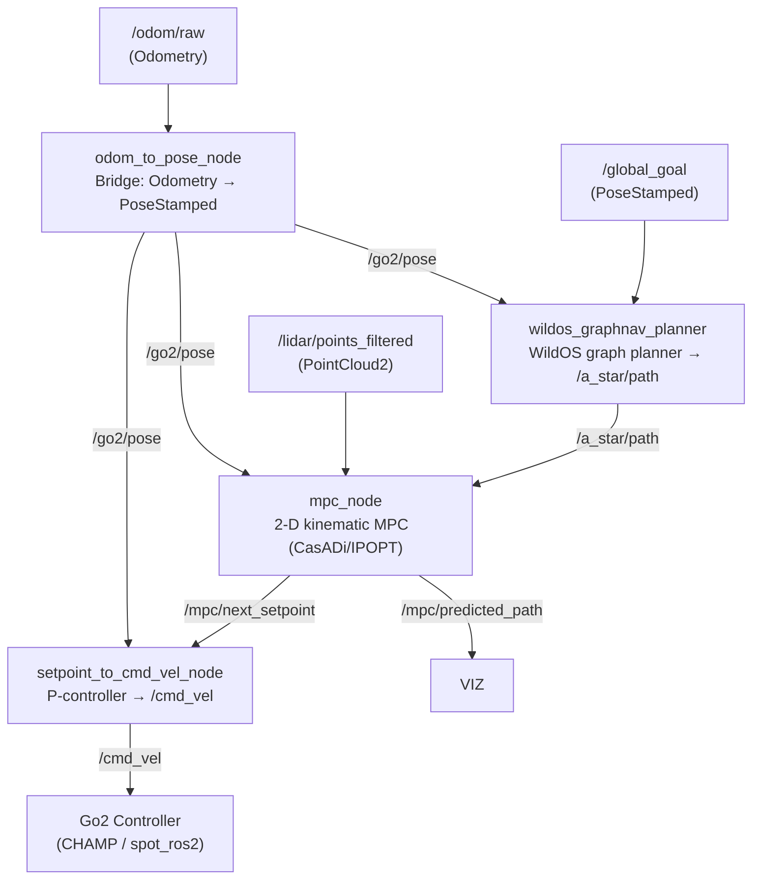

# WildOS Graph Planner + MPC for Go2 Quadruped

Local navigation stack for the Unitree Go2 quadruped robot.  
The Python workspace now contains the **MPC stack only**; the planner lives in the separate C++ package [wildos_graphnav_planner](../wildos_graphnav_planner). The C++ planner publishes a path that is remapped to `/a_star/path`, then the Python MPC node follows it and the setpoint controller converts the MPC lookahead pose into body-frame `/cmd_vel` commands.

---

## System Architecture



---

## Mathematical Description

### Stage 1 — WildOS-Style Navigation Graph

The planner package [wildos_graphnav_planner](../wildos_graphnav_planner) consumes a `graphnav_msgs/NavigationGraph` and converts it into a weighted adjacency graph. Nodes represent traversable waypoints; edges carry traversability costs. This is the same planning abstraction used by WildOS.

For Go2 integration, the planner publishes its result on `~/path`, and the launch file remaps that topic to `/a_star/path` so the existing Python MPC node can consume it unchanged.

**Graph parameters**

| Symbol | Parameter | Default |
|---|---|---|
| $c_f$ | `frontier_dist_cost_factor` | $2.0$ |
| $c_g$ | `goal_dist_cost_factor` | $1.0$ |
| $s_f$ | `frontier_score_factor` | $10.0$ |
| $r_f$ | `local_frontier_radius` | $7.0\,\text{m}$ |
| $r_g$ | `goal_radius` | $3.0\,\text{m}$ |

---

### Stage 2 — WildOS Dijkstra Planning

The planner adds a **virtual goal node** to the graph, connects all nodes inside `goal_radius`, and runs Dijkstra from the current node to the virtual goal. If frontiers are present, they are scored and optionally preferred for a limited timeout window, mirroring the WildOS exploitation/exploration behavior.

The output is a sequence of 3D waypoints converted into a `nav_msgs/Path`. That path is then consumed by the Python MPC node, which resamples it, smooths it, and builds the MPC reference trajectory.

---

### Stage 3 — 2-D Kinematic MPC (`MPCTracker`)

The MPC tracker solves a Nonlinear Program (NLP) symbolically compiled by **CasADi** and solved by **IPOPT** at every control tick (`mpc_rate_hz = 10\,\text{Hz}`).  
The NLP structure is built **once** at startup; only the numeric parameter values (initial state, reference trajectory, obstacle positions) are updated each call.

#### State and control

$$\mathbf{x}_k = \begin{bmatrix} p_{x,k} \\ p_{y,k} \\ \psi_k \end{bmatrix}, \qquad \mathbf{u}_k = \begin{bmatrix} v_{x,k} \\ v_{y,k} \\ \omega_k \end{bmatrix}$$

The Go2 is modelled as a **holonomic kinematic robot** — it can be commanded with independent forward, lateral and yaw-rate velocities simultaneously.

#### Discrete-time dynamics (Forward Euler, $\Delta t = 0.1\,\text{s}$)

$$\mathbf{x}_{k+1} = f(\mathbf{x}_k, \mathbf{u}_k) = \begin{bmatrix} p_{x,k} + (v_{x,k}\cos\psi_k - v_{y,k}\sin\psi_k)\,\Delta t \\ p_{y,k} + (v_{x,k}\sin\psi_k + v_{y,k}\cos\psi_k)\,\Delta t \\ \psi_k + \omega_k\,\Delta t \end{bmatrix}$$

#### Objective function

$$\min_{\mathbf{u}_{0\ldots N-1}} \; J = \underbrace{\mathbf{e}_N^\top \mathbf{Q}_T \mathbf{e}_N + J_{\text{obs}}(\mathbf{x}_N)}_{\text{terminal}} + \sum_{k=0}^{N-1} \Bigl[ \underbrace{\mathbf{e}_k^\top \mathbf{Q} \mathbf{e}_k}_{\text{tracking}} + \underbrace{\mathbf{u}_k^\top \mathbf{R} \mathbf{u}_k}_{\text{effort}} + \underbrace{R_{\text{jerk}}\|\Delta\mathbf{u}_k\|^2}_{\text{smoothness}} + \underbrace{J_{\text{obs}}(\mathbf{x}_k)}_{\text{obstacles}} \Bigr]$$

where $\mathbf{e}_k = \mathbf{x}_k - \mathbf{x}_{\text{ref},k}$ is the tracking error and

$$\mathbf{Q} = \text{diag}(Q_{xy},\; Q_{xy},\; Q_\psi), \qquad \mathbf{Q}_T = Q_T \cdot \mathbf{Q}, \qquad \mathbf{R} = \text{diag}(R_v,\; R_v,\; R_\omega)$$

| Term | Weight | Config key | Tuned value |
|---|---|---|---|
| $Q_{xy}$ | Position tracking | `mpc_Q_xy` | $200$ |
| $Q_\psi$ | Yaw tracking | `mpc_Q_yaw` | $1$ |
| $Q_T$ | Terminal multiplier | `mpc_Q_terminal` | $100$ |
| $R_v$ | Linear velocity effort | `mpc_R_vel` | $1$ |
| $R_\omega$ | Angular velocity effort | `mpc_R_omega` | $0.5$ |
| $R_{\text{jerk}}$ | Smoothness | `mpc_R_jerk` | $0.5$ |

#### Obstacle barrier

For each of the $M$ selected LiDAR points $\mathbf{p}_j$ and each predicted state $\mathbf{x}_k$, a logistic sigmoid barrier is added to the cost:

$$J_{\text{obs}}(\mathbf{x}_k) = \sum_{j=1}^{M} \frac{W}{1 + e^{\alpha \left(d(\mathbf{x}_k, \mathbf{p}_j) - r\right)}}$$

where $d(\mathbf{x}_k, \mathbf{p}_j) = \sqrt{(p_{x,k} - p_{j,x})^2 + (p_{y,k} - p_{j,y})^2 + \epsilon}$.

Numerically, the implementation uses the stable form $\tfrac{W}{2}(1 - \tanh(\tfrac{\alpha}{2}(d - r)))$, which avoids $e^{\infty}$ overflow.

| Symbol | Config key | Value | Role |
|---|---|---|---|
| $W$ | `mpc_W_obs_sigmoid` | $200$ | Barrier height |
| $\alpha$ | `mpc_obs_alpha` | $4\,\text{m}^{-1}$ | Steepness |
| $r$ | `mpc_obs_r` | $0.55\,\text{m}$ | Safety radius |
| $M$ | `mpc_max_obs_constraints` | $12$ | Points per solve |

Only the $M$ nearest LiDAR returns within `mpc_obs_check_radius` = $3\,\text{m}$ are used; the remainder are replaced with far sentinels at $(10^3, 10^3)$ so the NLP sparsity pattern never changes between solves.

#### Box constraints

$$-v_{x,\max} \le v_{x,k} \le v_{x,\max}, \quad -v_{y,\max} \le v_{y,k} \le v_{y,\max}, \quad -\omega_{\max} \le \omega_k \le \omega_{\max}$$

with $v_{x,\max} = 1.0\,\text{m/s}$, $v_{y,\max} = 0.5\,\text{m/s}$, $\omega_{\max} = 1.5\,\text{rad/s}$.

#### Reference trajectory construction

The reference $\{\mathbf{x}_{\text{ref},k}\}_{k=0}^{N}$ is built by advancing along the A\* path at cruise speed $v_{\text{ref}}$ from the closest waypoint to the robot:

$$s_k = \min\!\left(s_0 + v_{\text{ref}} \cdot k \cdot \Delta t,\; L_{\text{path}}\right)$$

where $s_0$ is the arc-length coordinate of the closest waypoint and $L_{\text{path}}$ is the total path arc length.  
Position $\mathbf{p}_{\text{ref},k}$ is linearly interpolated along the segment containing $s_k$; reference yaw is the tangent angle $\psi_{\text{ref},k} = \text{atan2}(\Delta y_{\text{seg}}, \Delta x_{\text{seg}})$.

Before entering the MPC, the raw A\* path is **resampled** at $\Delta s = 0.20\,\text{m}$ and **smoothed** with a moving-average kernel of width $5$ to remove cell-to-cell zig-zag jitter while preserving endpoints.

#### Warm starting

The previous solution is shifted by one step and used as the initial guess for the next solve, significantly reducing IPOPT iterations.  
On a solver failure the warm-start cache is cleared to avoid poisoning subsequent solves.

#### Setpoint extraction

After solving, the node walks the predicted trajectory $\mathbf{x}_{0\ldots N}$ and selects the first predicted state at least `mpc_lookahead_dist` = $2.0\,\text{m}$ ahead of the robot as the setpoint.  
If the entire horizon stays closer (near-goal), the last A\* waypoint is used directly.

A low-pass filter with $\alpha = 0.35$ and a maximum jump clamp of $0.30\,\text{m}$ smooths the published setpoint stream to prevent command jitter from path flicker.

---

### Stage 4 — Setpoint Controller (`setpoint_to_cmd_vel_node`)

A proportional controller running at $20\,\text{Hz}$ converts the MPC setpoint into body-frame `/cmd_vel`:

$$\begin{bmatrix} e_x \\ e_y \end{bmatrix}_{\text{body}} = \mathbf{R}(\psi)^\top \begin{bmatrix} s_x - p_x \\ s_y - p_y \end{bmatrix}$$

$$v_x^{\text{cmd}} = \text{clip}(k_{p,xy}\, e_x,\; \pm v_{x,\max}^{\text{cmd}}), \qquad v_y^{\text{cmd}} = \text{clip}(k_{p,xy}\, e_y,\; \pm v_{y,\max}^{\text{cmd}})$$

Optionally (when `enable_yaw_control: true`), the yaw error to the MPC-predicted heading is also fed through a P-controller:

$$\omega^{\text{cmd}} = \text{clip}(k_{p,\psi}\,\text{wrap}(\psi_{\text{sp}} - \psi),\; \pm\omega_{\max}^{\text{cmd}})$$

A safety timeout (`setpoint_timeout_sec = 2.0\,\text{s}`) zeroes `/cmd_vel` if no fresh setpoint arrives, preventing runaway motion.

---

## ROS 2 Interface

### `odom_to_pose_node`

| Direction | Topic | Type | Description |
|---|---|---|---|
| Sub | `/odom/raw` | `Odometry` | EKF pose from CHAMP/robot_localization |
| Pub | `/go2/pose` | `PoseStamped` | Republished pose for MPC and controller |

### `wildos_graphnav_planner`

| Direction | Topic | Type | Description |
|---|---|---|---|
| Sub | `~/nav_graph` | `graphnav_msgs/NavigationGraph` | WildOS navigation graph input |
| Sub | `~/goal_pose` | `PoseStamped` | Runtime goal override |
| Sub | `~/odom` | `Odometry` | Robot odometry for goal completion checks |
| Pub | `~/path` | `Path` | WildOS graph path, remapped to `/a_star/path` |

### `mpc_node`

| Direction | Topic | Type | Description |
|---|---|---|---|
| Sub | `/go2/pose` | `PoseStamped` | Robot pose |
| Sub | `/lidar/points_filtered` | `PointCloud2` | LiDAR hits (world frame) |
| Sub | `/a_star/path` | `Path` | WildOS planner path |
| Pub | `/mpc/next_setpoint` | `PoseStamped` | Lookahead setpoint |
| Pub | `/mpc/predicted_path` | `Path` | Full $N$-step predicted trajectory |
| Pub | `/mpc/diagnostics` | `Float64MultiArray` | `[success, cost, solve_ms, avg_ms, fails]` |

### `setpoint_to_cmd_vel_node`

| Direction | Topic | Type | Description |
|---|---|---|---|
| Sub | `/go2/pose` | `PoseStamped` | Robot pose |
| Sub | `/mpc/next_setpoint` | `PoseStamped` | MPC lookahead setpoint |
| Pub | `/cmd_vel` | `Twist` | Body-frame velocity commands |

---

## Parameters (`config/mpc_param.yaml`)

The MPC nodes share a single parameter file loaded with `--params-file`.

### WildOS planner node

| Parameter | Default | Description |
|---|---|---|
| `frontier_dist_cost_factor` | `2.0` | Frontier distance cost factor |
| `goal_dist_cost_factor` | `1.0` | Goal distance cost factor |
| `frontier_score_factor` | `10.0` | Frontier score shaping factor |
| `min_local_frontier_score` | `0.4` | Minimum score for local frontier reuse |
| `local_frontier_radius` | `7.0 m` | Radius for local frontier reuse |
| `path_smoothness_period` | `10.0 s` | Window for frontier smoothing |
| `trav_class` | `default` | Traversability class to use |
| `goal_radius` | `3.0 m` | Radius for connecting the virtual goal node |

### MPC node

| Parameter | Default | Description |
|---|---|---|
| `mpc_N` | `30` | Prediction horizon steps |
| `mpc_dt` | `0.10 s` | Step duration (horizon = 3 s) |
| `mpc_rate_hz` | `10.0 Hz` | Solve frequency |
| `mpc_vx_max` | `1.0 m/s` | Max forward velocity |
| `mpc_vy_max` | `0.5 m/s` | Max lateral velocity |
| `mpc_omega_max` | `1.5 rad/s` | Max yaw rate |
| `mpc_v_ref` | `0.5 m/s` | Reference cruise speed $v_{\text{ref}}$ |
| `mpc_Q_xy` | `200.0` | Position tracking weight $Q_{xy}$ |
| `mpc_Q_yaw` | `1.0` | Yaw tracking weight $Q_\psi$ |
| `mpc_Q_terminal` | `100.0` | Terminal cost multiplier $Q_T$ |
| `mpc_R_vel` | `1.0` | Linear velocity effort $R_v$ |
| `mpc_R_omega` | `0.5` | Angular velocity effort $R_\omega$ |
| `mpc_R_jerk` | `0.5` | Smoothness weight $R_{\text{jerk}}$ |
| `mpc_W_obs_sigmoid` | `200.0` | Obstacle barrier weight $W$ |
| `mpc_obs_alpha` | `4.0 m⁻¹` | Barrier steepness $\alpha$ |
| `mpc_obs_r` | `0.55 m` | Safety radius $r$ |
| `mpc_max_obs_constraints` | `12` | LiDAR points per solve $M$ |
| `mpc_obs_check_radius` | `3.0 m` | Obstacle search radius |
| `mpc_lookahead_dist` | `2.0 m` | Setpoint lookahead distance |
| `mpc_warm_start` | `true` | Warm-start IPOPT from previous solution |
| `mpc_max_iter` | `100` | Max IPOPT iterations |

### Setpoint controller node

| Parameter | Default | Description |
|---|---|---|
| `cmd_rate_hz` | `20.0 Hz` | `/cmd_vel` publish frequency |
| `cmd_kp_xy` | `2.0` | Body-frame XY proportional gain $k_{p,xy}$ |
| `cmd_kp_yaw` | `1.2` | Yaw proportional gain $k_{p,\psi}$ |
| `cmd_max_vx` | `0.8 m/s` | Forward speed clamp |
| `cmd_max_vy` | `0.25 m/s` | Lateral speed clamp |
| `cmd_max_omega` | `1.0 rad/s` | Yaw-rate clamp |
| `cmd_stop_radius` | `0.2 m` | Zero `/cmd_vel` within this distance of setpoint |
| `setpoint_timeout_sec` | `2.0 s` | Safety timeout before zeroing commands |
| `enable_yaw_control` | `true` | Enable path-aligned heading control |

---

## Build

```bash
cd ~/go2/anubi
colcon build --packages-select mpc
source install/setup.bash
```

---

## Running the Stack

The MPC nodes must run alongside the separate WildOS planner package. Open the required terminals after sourcing `source ~/go2/anubi/install/setup.bash`.

```bash
ros2 launch robot_sim planner.launch.py
```

For now the odometry bridge is done through Gazebo plugins, so the above command runs the full stack in simulation. In the future, the `odom_to_pose_node` will require to subscribe to the real robot's EKF output instead.

---

## Diagnostics

Monitor the MPC solver health:

```bash
ros2 topic echo /mpc/diagnostics
# data: [success(0/1), cost, solve_time_ms, avg_solve_ms, total_failures]
```

Watch the predicted horizon and occupancy grid in Foxglove Studio or RViz2:

| Topic | Type | Visualisation |
|---|---|---|
| `/a_star/path` | `Path` | WildOS planner path |
| `/mpc/predicted_path` | `Path` | MPC predicted trajectory |
| `/mpc/next_setpoint` | `PoseStamped` | Current setpoint arrow |

---

## Dependencies

- ROS 2 Humble or Foxy
- `casadi` — symbolic NLP formulation and code generation
- `ipopt` — interior-point NLP solver (via CasADi)
- `numpy`, `scipy`
- `sensor_msgs_py`

---

## File Overview

```
mpc/
├── mpc_node.py                 — ROS 2 node: path + LiDAR → MPC → /mpc/next_setpoint
├── mpc_tracker.py              — CasADi/IPOPT MPC, dynamics, NLP build
├── setpoint_to_cmd_vel_node.py — P-controller: setpoint + pose → /cmd_vel
├── odom_to_pose_node.py        — Bridge: /odom/raw (Odometry) → /go2/pose (PoseStamped)
├── graph planning now lives in the separate C++ package wildos_graphnav_planner/
└── config/
    └── mpc_param.yaml          — Shared parameters for the Python MPC nodes
```
